# नगरसेवक व्यवस्थापन प्रणाली - संपूर्ण वापरकर्ता मार्गदर्शिका (Complete User Manual)

## प्रस्तावना
नगरसेवक व्यवस्थापन प्रणालीमध्ये आपले स्वागत आहे. या प्रणालीच्या माध्यमातून आपण आपल्या प्रभागातील प्रत्येक बारीक-सारीक गोष्टींचे (मतदार, विकासकामे, तक्रारी, योजना, पत्रव्यवहार, इ.) अत्यंत प्रभावीपणे व्यवस्थापन करू शकता. खालीलप्रमाणे प्रणालीच्या सर्व वैशिष्ट्यांची सविस्तर माहिती दिली आहे.

---

## १. मुख्य डॅशबोर्ड (Dashboard)
डॅशबोर्ड हा प्रणालीचा मुख्य आणि पहिला भाग आहे, जिथे आपल्याला ॲपचा संपूर्ण गोषवारा एका स्क्रीनवर दिसतो. 
- **एकूण मतदार (Total Voters):** प्रभागातील एकूण नोंदणीकृत मतदारांची संख्या येथे दिसते.
- **प्रलंबित तक्रारी (Pending Complaints):** नागरिकांनी नोंदवलेल्या पण अद्याप न सोडवलेल्या तक्रारी.
- **एकूण विकासकामे (Total Works):** प्रभागात चालू असलेली किंवा पूर्ण झालेली सर्व कामे.
- **बजेट (Budget):** उपलब्ध आणि वापरलेल्या निधीचा तपशील.
- **अलीकडील घडामोडी (Recent Activity):** प्रणालीत नुकतीच झालेली कामे किंवा नोंदी येथे दिसतात.

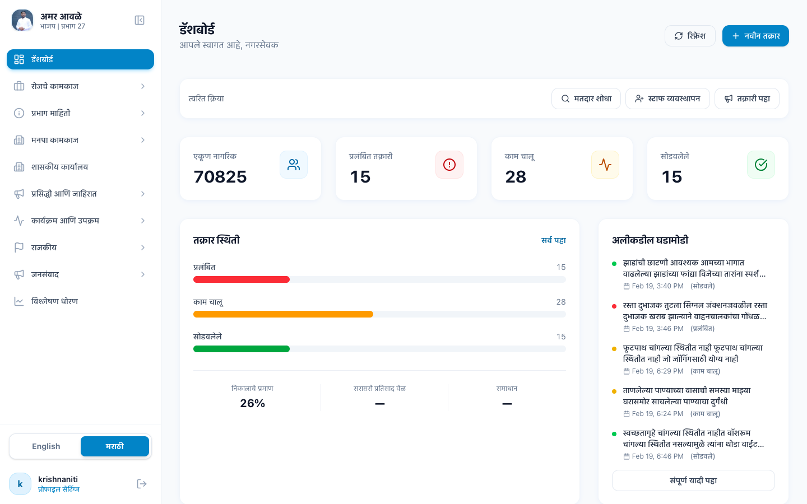

---

## २. दैनंदिन कामकाज (Daily Work)
हा विभाग दैनंदिन कामांसाठी वापरला जातो. यामध्ये खालील घटकांचा समावेश आहे:

### २.१ तक्रारी आणि विनंती (Complaints)
- **वापर:** नागरिकांनी नोंदवलेल्या तक्रारी किंवा वैयक्तिक विनंत्यांचे निवारण करण्यासाठी.
- **नवीन तक्रार (New Complaint):** रस्त्यावरील खड्डे, पाणीटंचाई, वीज समस्या यांसारख्या तक्रारींची इथे सविस्तर माहिती फोटोसहित नोंदवता येते.
- **स्थिती (Status):** तक्रार 'प्रलंबित', 'प्रगतीपथावर', किंवा 'पूर्ण' आहे का ते येथे ट्रॅक केले जाते.

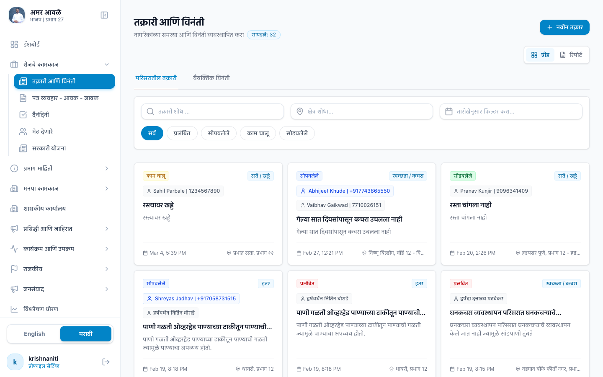

### २.२ पत्रे (Letters)
- **वापर:** कार्यालयात येणाऱ्या (Incoming) आणि कार्यालयातून जाणाऱ्या (Outgoing) पत्रांचे व्यवस्थापन.
- **नवीन पत्र नोंदणी:** स्कॅन केलेली पत्रे प्रणालीत अपलोड करून त्याची नोंद ठेवता येते.

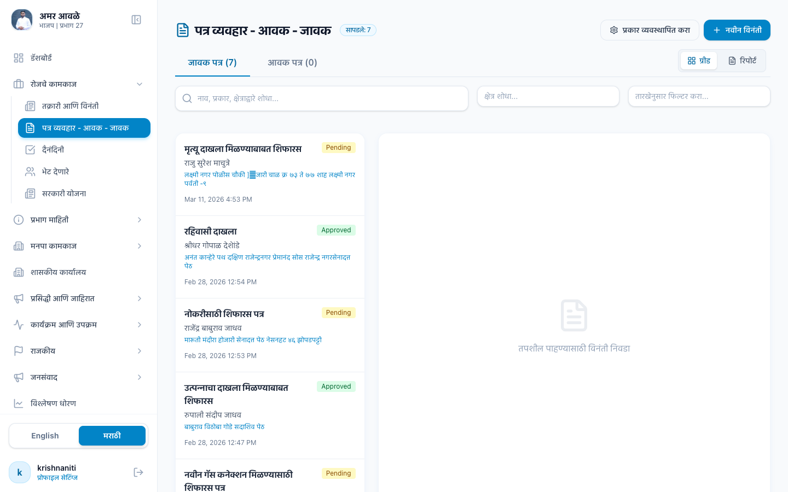

### २.३ कामकाज व्यवस्थापन (Task Management)
- **वापर:** नगरसेवक किंवा कर्मचाऱ्यांनी एकमेकांना नेमून दिलेली दैनंदिन कामे (Tasks) आणि त्यांची सद्यस्थिती पाहण्यासाठी.

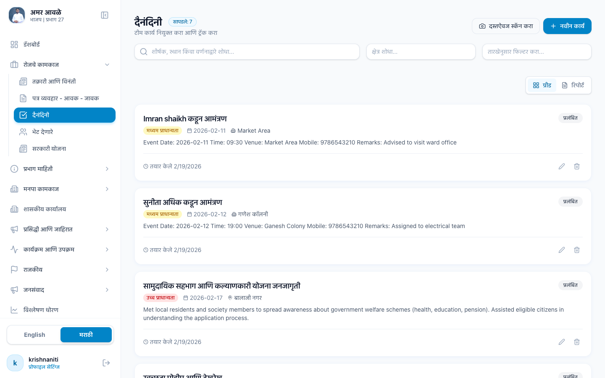

### २.४ भेट देणाऱ्यांची नोंद (Visitor Log)
- **वापर:** कार्यालयात दररोज येणाऱ्या नागरिकांची आणि त्यांच्या कामाची नोंद ठेवणे.

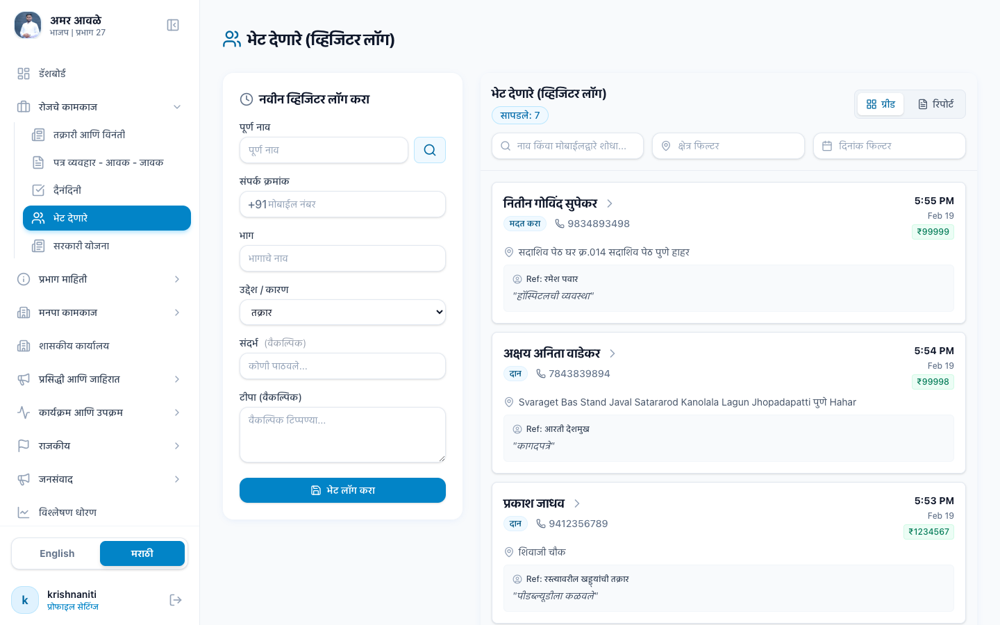

### २.५ शासकीय योजना (Govt Schemes)
- **वापर:** शासन स्तरावर उपलब्ध असलेल्या विविध योजना आणि त्यांच्या लाभार्थ्यांची नोंद ठेवणे.

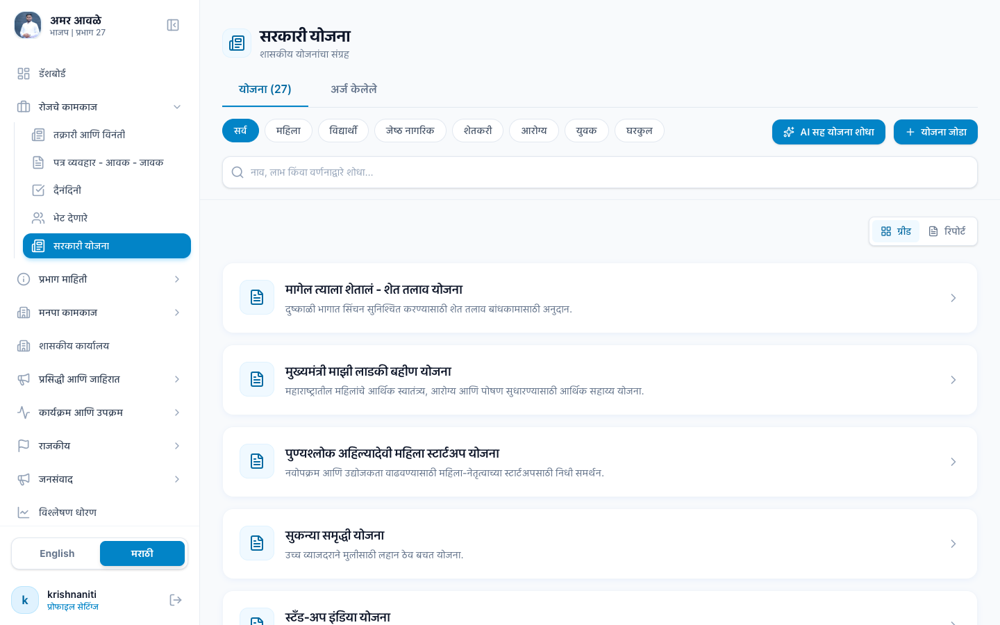

---

## ३. प्रभाग माहिती (Ward Information)
आपल्या प्रभागाची सर्वंकष माहिती येथे एकाच ठिकाणी उपलब्ध असते.

### ३.१ प्रभागातील समस्या (Ward Problem)
- **वापर:** प्रभागातील प्रमुख आणि वारंवार उद्भवणाऱ्या समस्यांची प्रभागनिहाय यादी आणि त्यांच्यावर केलेले उपाय नोंदवणे.

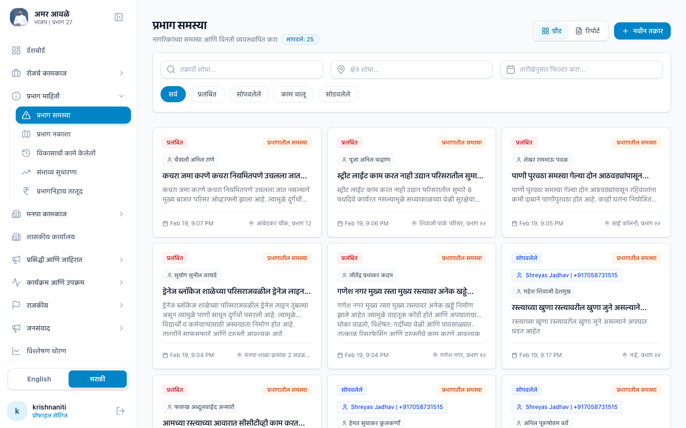

### ३.२ प्रभागाचा नकाशा (Ward Map)
- **वापर:** प्रभागाचा भौगोलिक नकाशा पाहणे. यात रस्त्यांची हद्द आणि इतर महत्त्वाच्या सीमा स्पष्ट दिसतात.

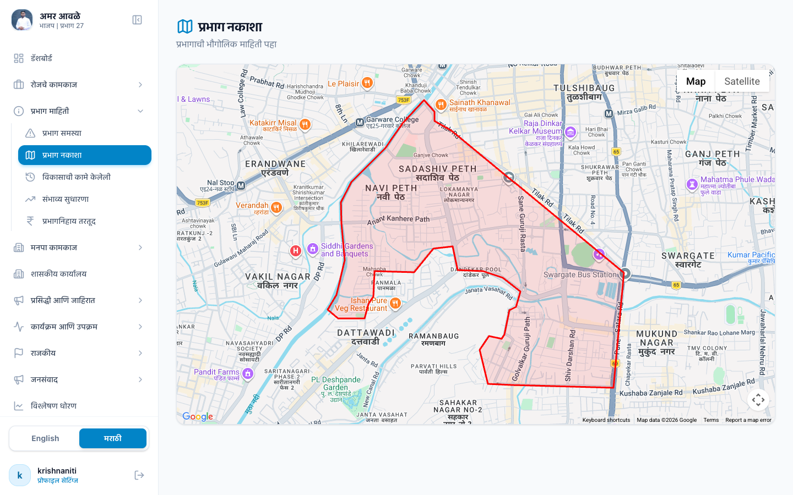

### ३.३ कामाचा इतिहास (Work History)
- **वापर:** आतापर्यंत पूर्ण झालेल्या सर्व विकासकामांचा मागोवा घेणे आणि त्यांचा अहवाल (Ahwal Report) काढणे. 

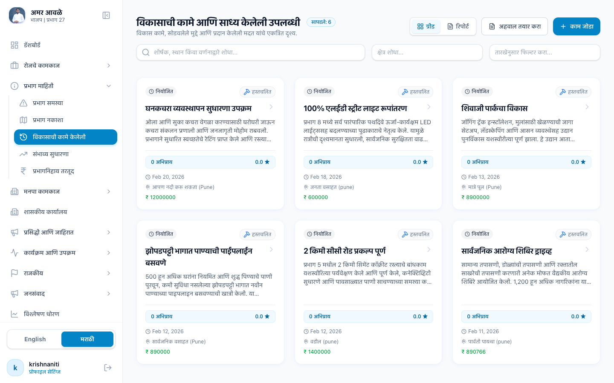

### ३.४ प्रभाग सुधारणा (Ward Improvement)
- **वापर:** भविष्यात प्रभागात कोणत्या सुधारणा करणे आवश्यक आहे, त्याचा आराखडा येथे मांडला जातो.

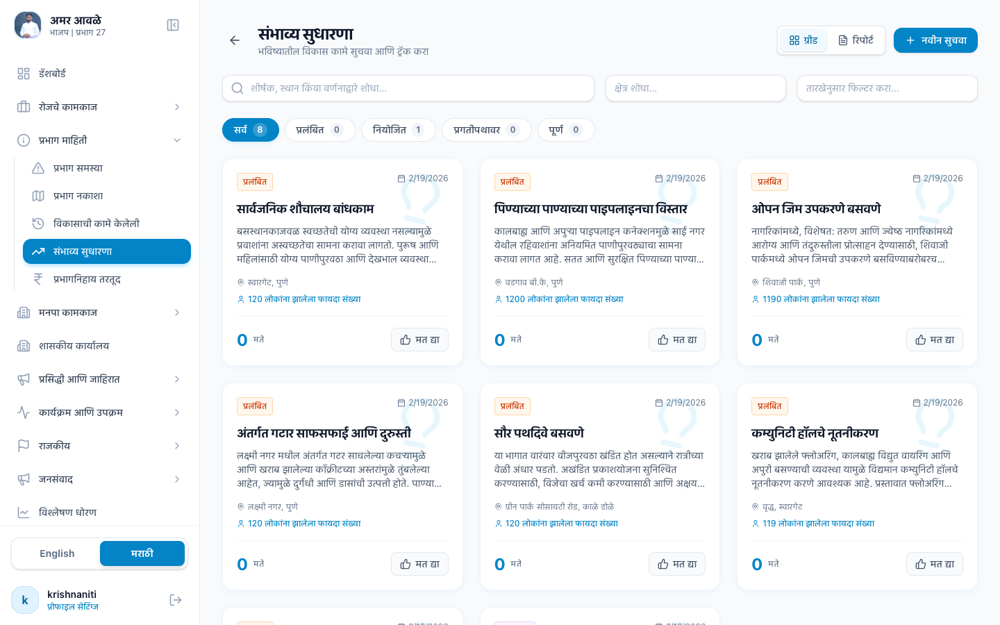

### ३.५ प्रभागातील तरतूद (Ward Provision)
- **वापर:** प्रभागासाठी मंजूर झालेल्या एकूण आर्थिक तरतुदी आणि निधीचे तपशीलवार वर्णन.

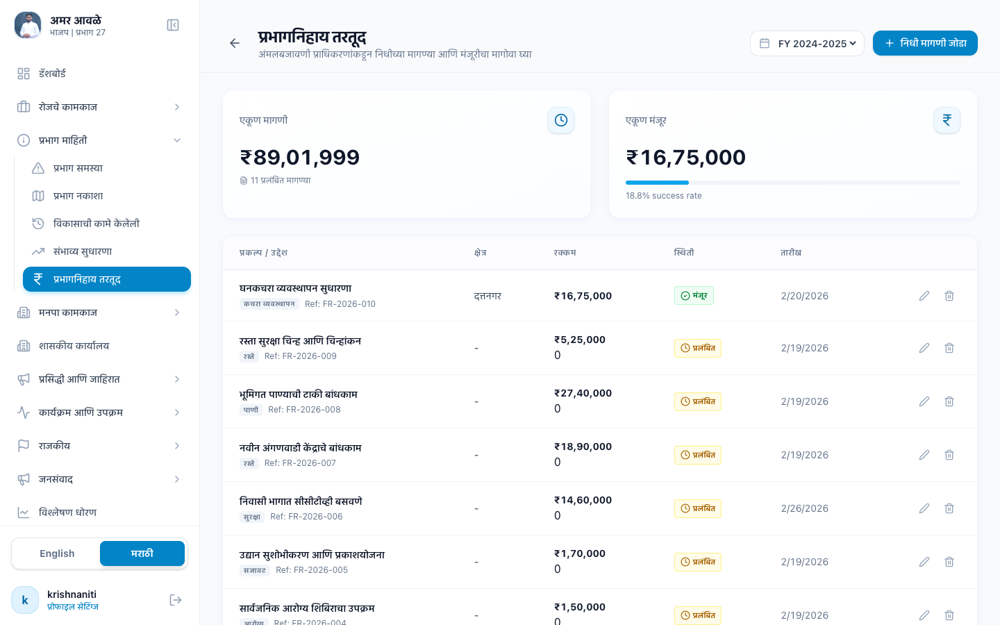

---

## ४. महानगरपालिका कामकाज (Municipal Work)
महानगरपालिकेशी संबंधित अधिकृत कामांची नोंद या विभागात होते.

### ४.१ सर्वसाधारण सभा नोंदवही (GB Register)
- **वापर:** सर्वसाधारण सभेतील (General Body Meeting) ठराव, चर्चा आणि निर्णयांची नोंद वह्यांप्रमाणे ठेवणे.

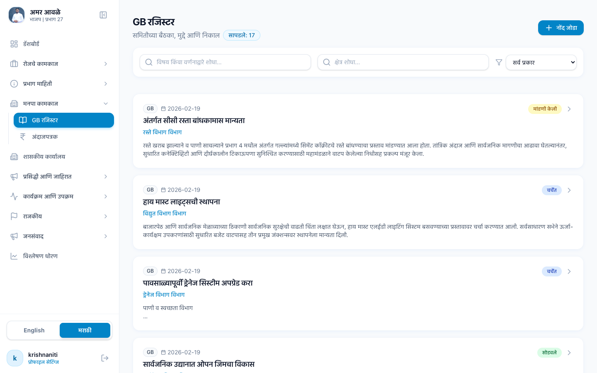

### ४.२ प्रभागाचे बजेट (Ward Budget)
- **वापर:** महानगरपालिकेकडून मिळालेला निधी आणि तो कुठे-कुठे खर्च झाला याचा आलेख व तक्ते (Charts) पाहणे.

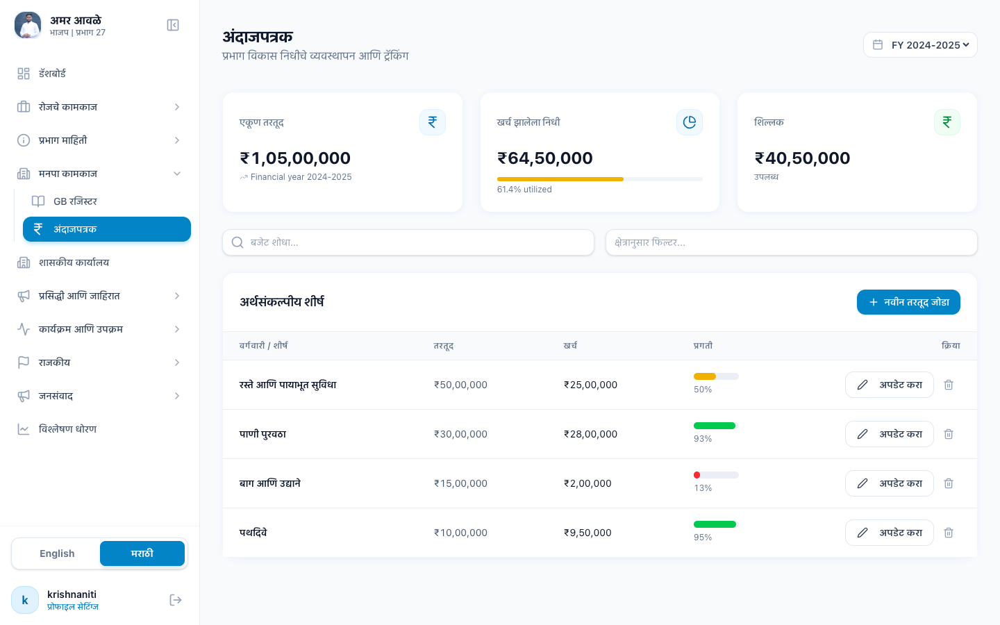

---

## ५. शासकीय कार्यालय (Gov Office)
- **वापर:** प्रशासकीय आणि शासकीय कार्यालयांतील प्रलंबित कामांचा पाठपुरावा या स्क्रीनवरून करता येतो.

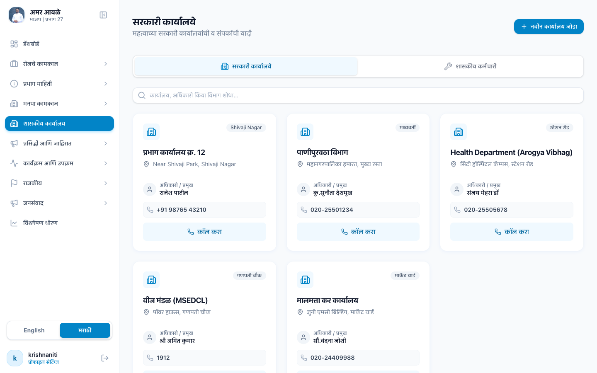

---

## ६. प्रसारमाध्यमे आणि जाहिरात (Media & Promotion)
जनसंपर्क वाढवण्यासाठी हा विभाग अत्यंत महत्त्वाचा आहे.

### ६.१ सोशल मीडिया विश्लेषण (Social Analytics)
- **वापर:** फेसबुक, इन्स्टाग्राम आणि इतर सोशल प्लॅटफॉर्म्सवरील पोस्ट्सचे लाइक्स आणि रीच (Reach) तपासणे.

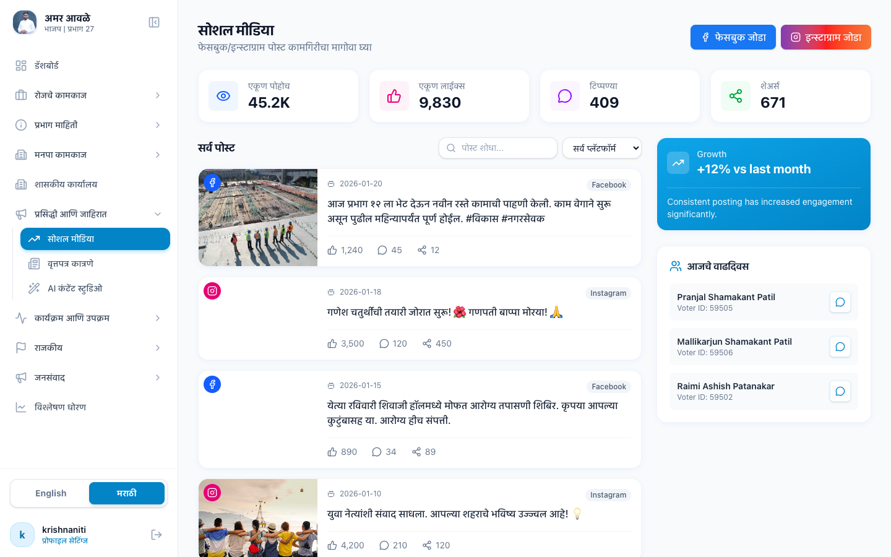

### ६.२ वृत्तपत्र कात्रणे (Newspaper Clipping)
- **वापर:** वर्तमानपत्रात आलेल्या नगरसेवकांच्या बातम्यांची कात्रणे स्कॅन करून इथे संग्रहित करणे.

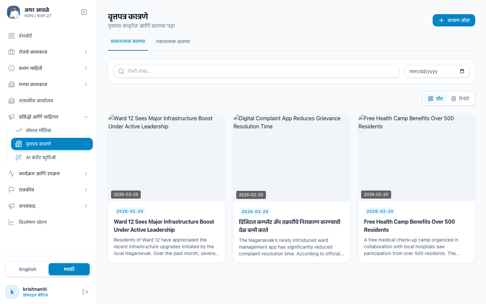

### ६.३ AI सामग्री (AI Content)
- **वापर:** सोशल मीडिया पोस्ट्ससाठी किंवा भाषणांसाठी AI (कृत्रिम बुद्धिमत्ता) च्या मदतीने उत्कृष्ट मजकूर तयार करणे.

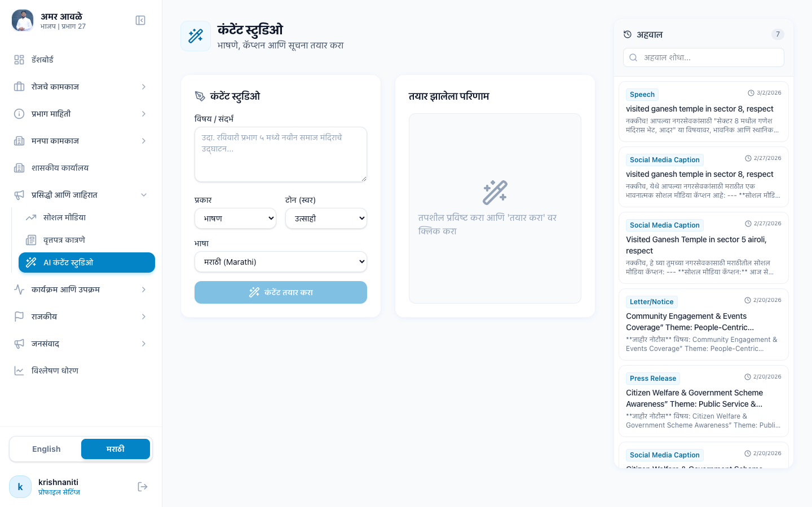

---

## ७. कार्यक्रम आणि उपक्रम (Programs & Activities)
नागरिकांसाठी आयोजित कार्यक्रमांचे नियोजन या विभागात होते.

### ७.१ कार्यक्रम आणि आमंत्रणे (Events & Invites)
- **वापर:** नवीन कार्यक्रम तयार करणे, त्याची तारीख निश्चित करणे आणि नागरिकांना SMS/WhatsApp ने आमंत्रणे पाठवणे.

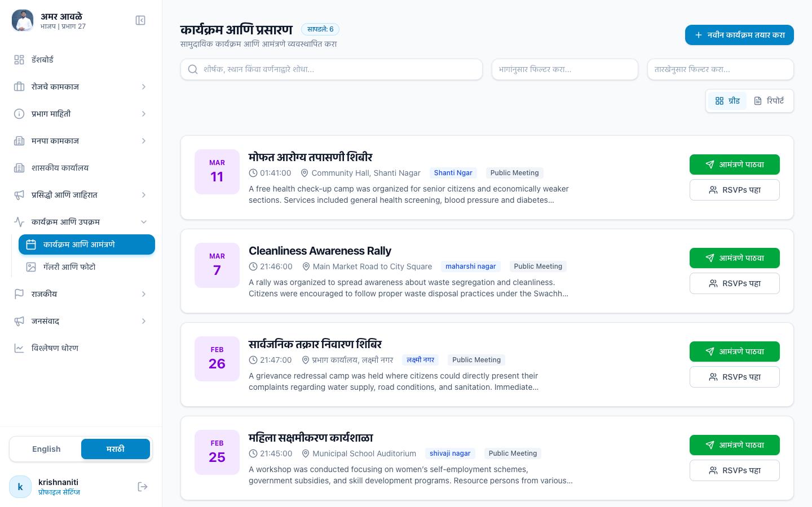

### ७.२ गॅलरी आणि मीडिया (Gallery & Media)
- **वापर:** झालेले कार्यक्रम, सभा किंवा विकासकामांच्या उद्घाटनाचे फोटो येथे अल्बम स्वरूपात साठवून ठेवले जातात.

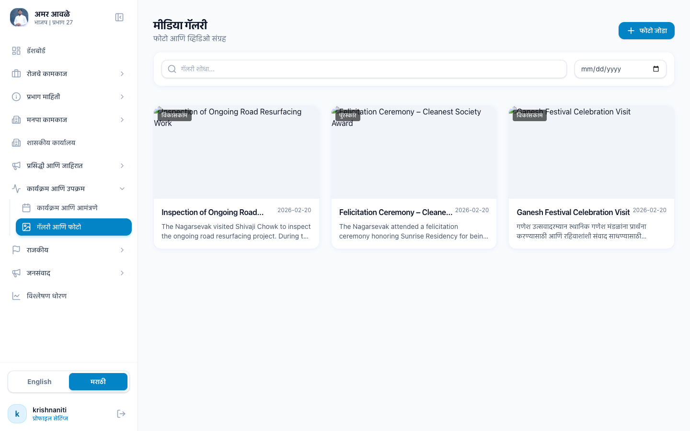

---

## ८. राजकीय (Political)
मतदार आणि राजकीय पक्षाच्या दृष्टिकोनातून लागणारी सर्व माहिती इथे उपलब्ध आहे.

### ८.१ निकाल विश्लेषण (Result Analysis)
- **वापर:** मागील निवडणुकांमधील बूथ (Booth) निहाय मिळालेल्या मतांचे विश्लेषण करणे.

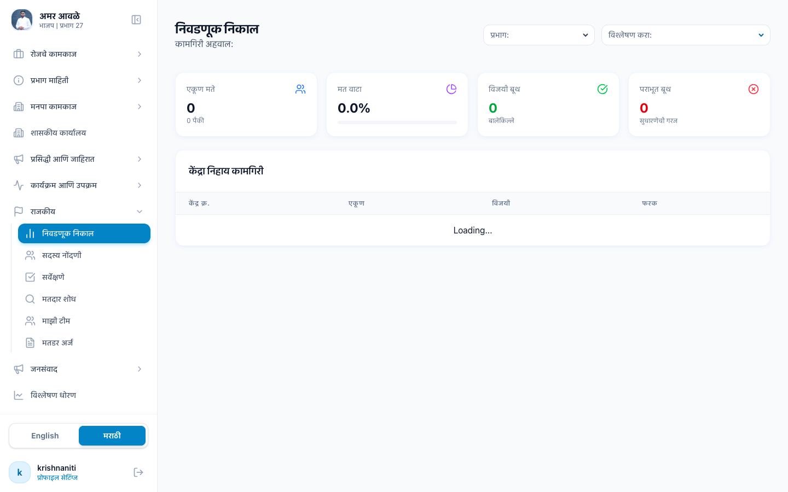

### ८.२ सदस्य (Sadasya)
- **वापर:** पक्षात नव्याने जोडल्या गेलेल्या सदस्यांची आणि कार्यकर्त्यांची नोंदणी करणे.

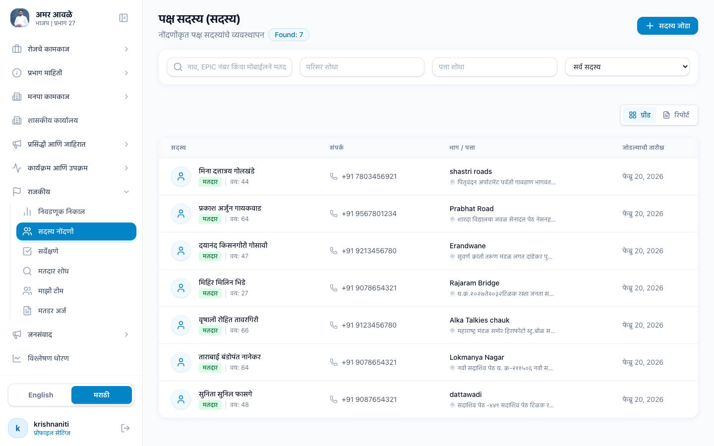

### ८.३ नमुना सर्वेक्षण (Sample Surveys)
- **वापर:** निवडणुकीपूर्वी किंवा कोणत्याही विषयावर नागरिकांचे मत जाणून घेण्यासाठी सर्वे (Survey) तयार करणे आणि त्याची लिंक पाठवणे.

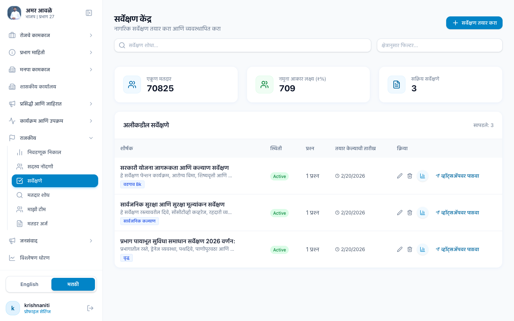

### ८.४ मतदार शोध (Voter Search)
- **वापर:** प्रभागातील कोणत्याही मतदाराचे नाव, वय किंवा यादी (List Index) वरून क्षणात सर्च करणे.

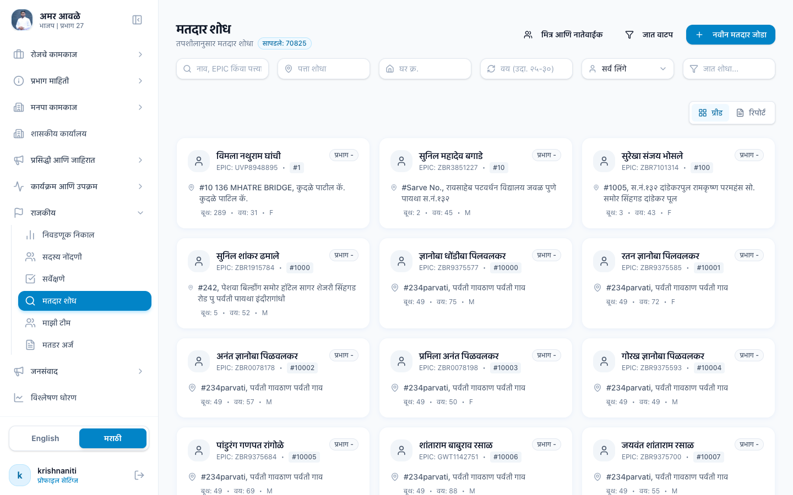

### ८.५ माझी टीम (My Team)
- **वापर:** कार्यालयातील कर्मचाऱ्यांचे (Staff) व्यवस्थापन करणे आणि त्यांना ॲपमध्ये कोणत्या सुविधा द्यायच्या (Permissions) त्याचे नियंत्रण करणे.

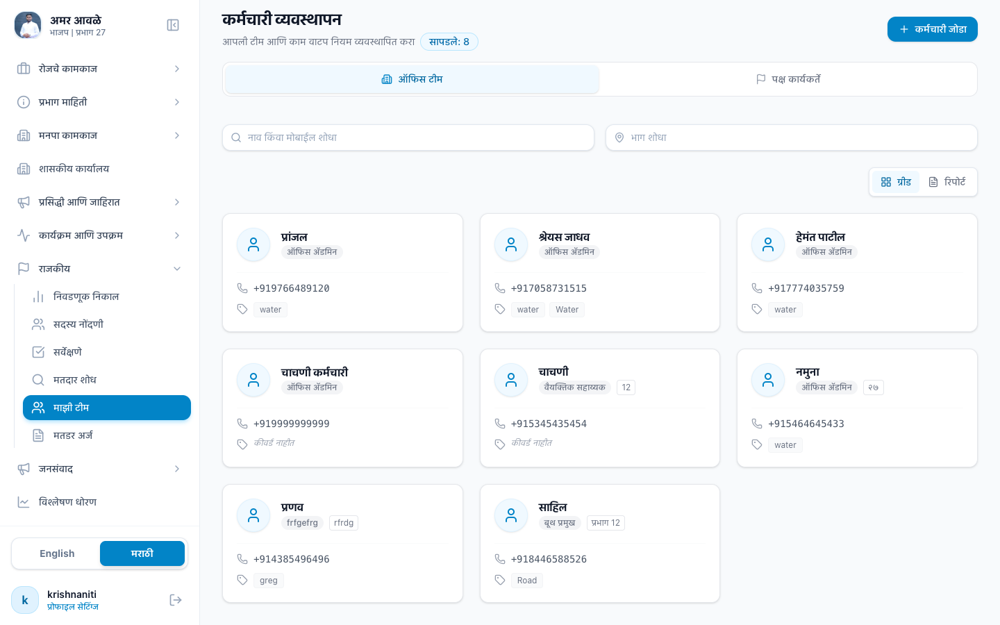

### ८.६ मतदार फॉर्म (Voter Forms)
- **वापर:** नवीन मतदार नोंदणी फॉर्म्स (उदा. फॉर्म ६, ८) भरणे.

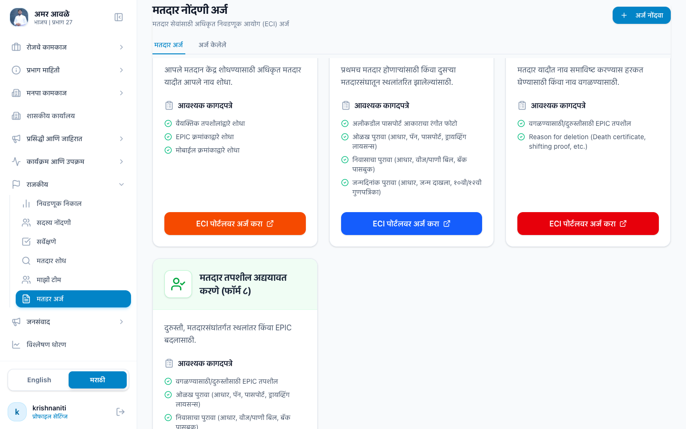

---

## ९. सार्वजनिक संवाद (Public Communication)
नागरिकांशी थेट संपर्क वाढवण्यासाठी प्रणालीत अत्याधुनिक संवाद सुविधा आहेत!

- **SMS पाठवा (Send SMS):** कार्यक्रमांचे आणि महत्त्वाचे संदेश नागरिकांना एका क्लिकवर SMS करणे.
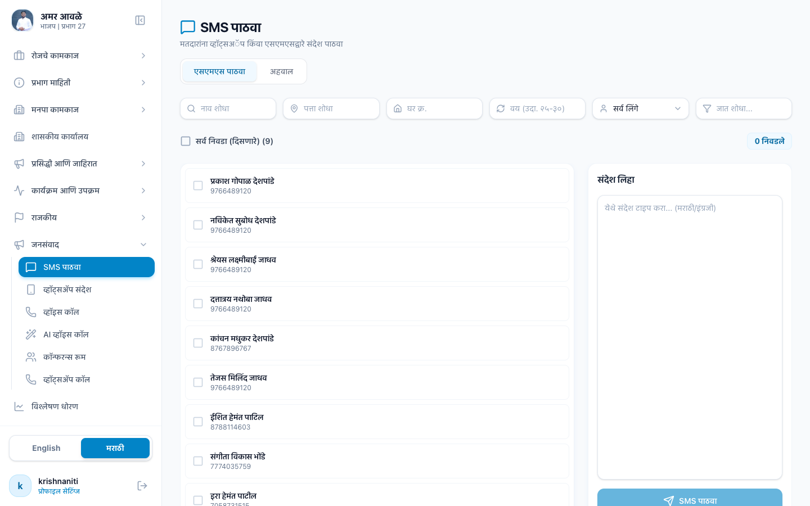

- **WhatsApp मेसेज (WhatsApp Message):** WhatsApp वरून बल्क मेसेज (Bulk Messages) पाठवणे.
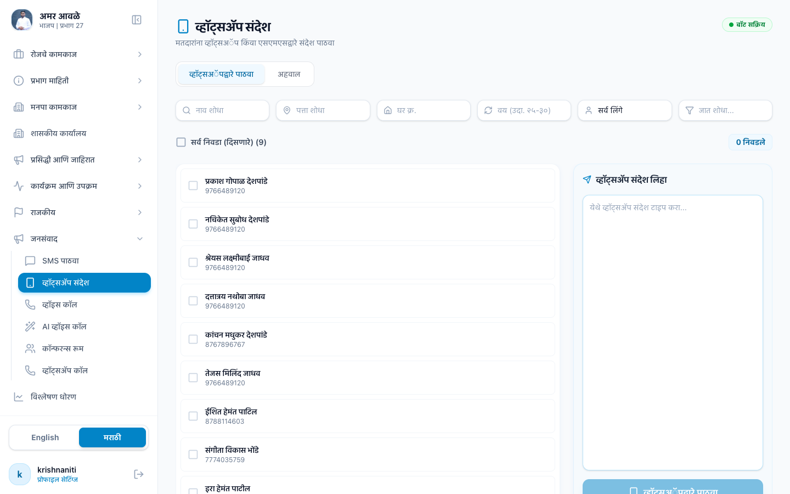

- **व्हॉइस कॉल (Voice Call):** नागरिकांशी संवाद साधण्यासाठी टेलिफोनिक कॉल्स करणे.
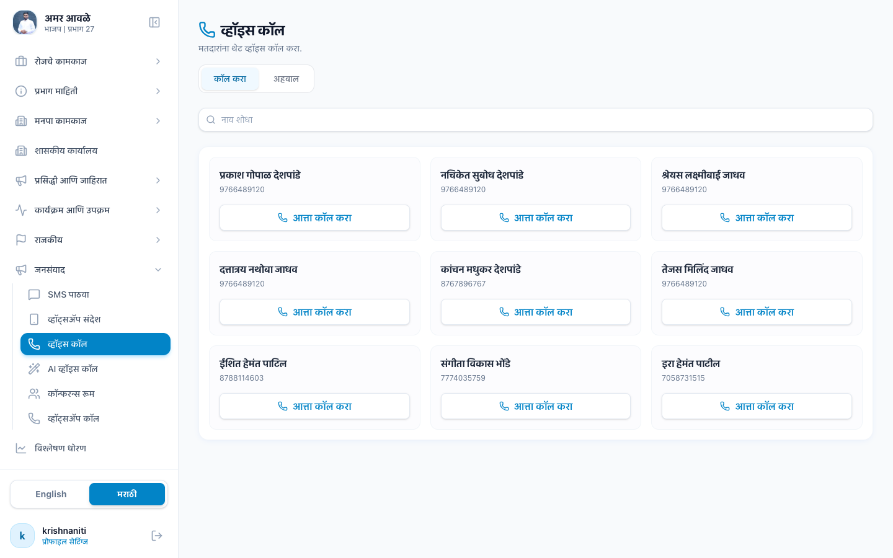

- **AI व्हॉइस कॉल (AI Voice Call):** आर्टिफिशिअल इंटेलिजन्सद्वारे (AI Bot) नागरिकांना स्वयंचलित व्हॉइस कॉल्स करून त्यांच्या अडचणी समजून घेणे. 
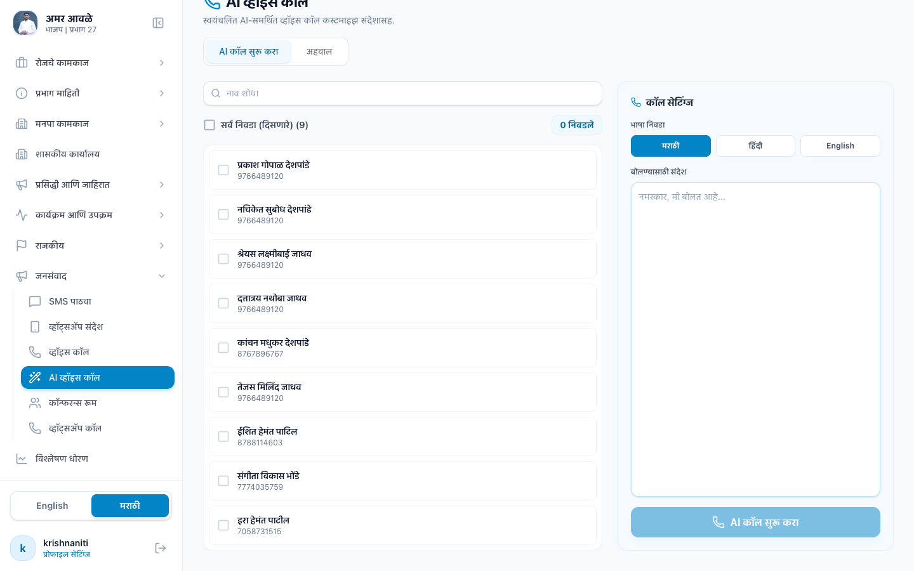

- **कॉन्फरन्स रूम (Conference Room):** कार्यकर्त्यांसोबत ऑनलाइन बैठका (Meetings) आयोजित करणे.
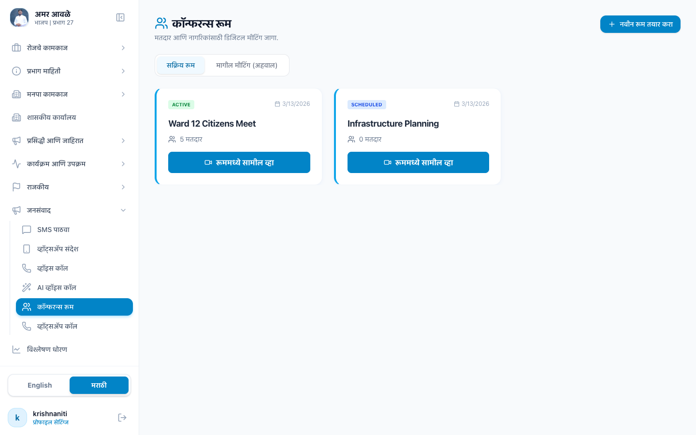

- **WhatsApp कॉल (WhatsApp Call):** WhatsApp द्वारे थेट कॉल करणे.
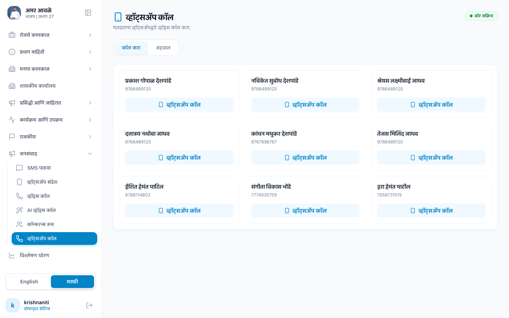

---

## १०. विश्लेषण रणनीती (Analysis Strategy)
- **वापर:** सर्व राजकीय, सामाजिक आणि भौगोलिक माहितीचा आधार घेऊन भविष्यातील राजकीय रणनीती (Political Strategy) आणि धोरणे ठरवण्यासाठी उपयुक्त असलेला अत्यंत प्रगत (Advanced) डॅशबोर्ड.

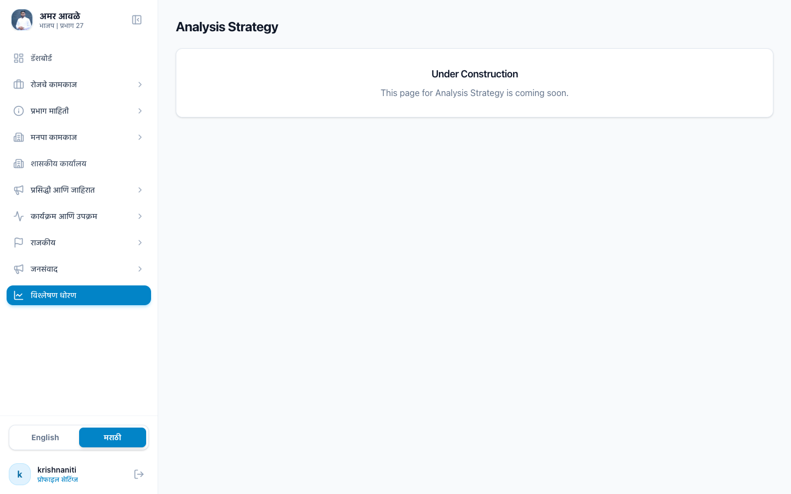

---

*टीप: वरीलपैकी कोणताही पर्याय वापरताना अडचण आल्यास कृपया प्रणाली प्रशासकाशी (System Administrator) संपर्क साधावा.*
